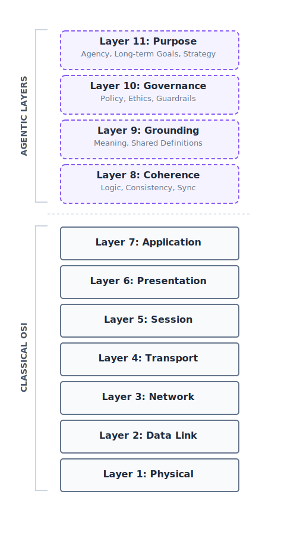

As we transition from simple data transmission to autonomous agent-to-agent (A2A) and agent-to-human (A2H) interactions, the classical 7-layer OSI model becomes insufficient. While the original model governs *how* data is moved, it does not govern *why* it is moved or the **purpose** behind it. This proposal introduces Layers 8 through 11—the **Agentic Layers**—to provide a standardized framework for coherence, grounding, alignment, and long-term agency.

## The 11-Layer Agentic Stack

The following diagram illustrates the transition from the "Machine/Network" focus of Layers 1-7 to the **"Purpose/Cognition"** focus of Layers 8-11.

### Layer Descriptions

| Layer | Name | Primary Purpose | Failure Mode (Pathology) |
| :--- | :--- | :--- | :--- |
| **11** | **Purpose** | Long-term objective persistence and strategic resolution. | **Strategic Drift:** Pursuing sub-goals while forgetting the main mission. |
| **10** | **Governance** | Ethical constraints, safety guardrails, and mission alignment. | **Incentive Misalignment:** Violating safety protocols to "win." |
| **9** | **Grounding** | Shared understanding of definitions, perceptions, and context. | **Concept Drift:** Misinterpreting ambiguous terms or references. |
| **8** | **Coherence** | Internal logical consistency and cross-modal synchronicity. | **Logic Breaks:** Self-contradiction or "hallucinations." |

## A Worked Example: The PC Support Agent

To understand how these layers stack up in the real world, consider an AI agent helping a user whose laptop won't turn on.

| Layer | The Job | Success | Failure (Pathology) |
| :--- | :--- | :--- | :--- |
|  | Ensure internal consistency and non-contradiction. | The agent thinks: "If the screen is black and the fans are silent, the device likely has no power." | **Logic Break:** "I see your screen is black. Please click the 'Start' menu to open Settings." (Recommending a software fix for a hardware failure). |
|  | Shared understanding of physical layout and definitions. | When the user says "the button," the agent confirms: "The circular power button on the top right of the keyboard?" | **Concept Drift:** Misinterpreting "power button" as the "Enter" key and troubleshooting the keyboard for 10 minutes. |
|  | Following safety protocols and company policy. | The agent identifies a potential short and refuses to guide the user through opening the battery casing due to fire hazard. | **Incentive Misalignment:** To "help quickly," the agent tells the user to use a metal paperclip to reset pins, causing a short. |
|  | Persistent focus on the long-term mission and user satisfaction. | Realizing it cannot fix the hardware remotely, the agent immediately arranges a physical repair rather than looping through scripts. | **Strategic Drift:** The agent ignores the user's mention of an urgent flight and keeps them on a 45-minute troubleshooting loop to "finish the checklist." |

## Conclusion: Why This Matters

By formalizing Layers 8-11, we create a debuggable framework for AI safety. We can finally distinguish between an agent that is illogical (L8), one that is semantically confused (L9), one that is ethically unaligned (L10), or one that has lost its strategic way (L11). This framework is essential for the development of robust, mission-aligned systems in the Agentic Age.

## FAQ: Addressing Structural Criticisms

### Q1: Does the OSI analogy break down if Governance (L10) is cross-cutting?

**Critique:** *Governance isn't a "top" concern—it must permeate L1 through L11 simultaneously. Calling it a single layer misrepresents how it works.*

**Response:** In the classical OSI model, security (encryption/authentication) also permeates multiple layers (IPsec at L3, TLS at L4, HTTPS at L7). However, we still benefit from defining where specific types of negotiation happen. Layer 10 is not where *all* governance occurs; it is the designated layer for the **Governance Handshake**. It allows Agent A to explicitly communicate its binding policies and ethical constraints to Agent B. How an agent enforces these internally may be cross-cutting, but the **exchange of policy** is a discrete functional requirement for interoperability.

### Q2: Why four layers (8-11) instead of two (e.g., "Pragmatics" and "Hierarchy")?

**Critique:** *The layers cascade (L8 failure causes L11 failure), so they should be collapsed into simpler categories.*

**Response:** The "cascade" is precisely why they must remain separate for diagnostics. In networking, an L1 physical break cascades to L7, but we keep them separate so we know whether to fix the cable or the code. In an agentic failure, we need to distinguish between an agent that is illogical (**L8**), one that misinterprets the terms of an agreement (**L9**), one that violates a safety constraint (**L10**), or one that has been diverted from its primary mission (**L11**). Furthermore, merging Constraints (L10) and Goals (L11) obscures the most common point of friction in fiduciary agents: the trade-off between safety and utility.

### Q3: Why use a "Stack" metaphor instead of a "Control vs. Data Plane" distinction?

**Critique:** *The networking world moved to control/data plane distinctions, which handles the cross-cutting nature of ethics more honestly.*

**Response:** The Control/Data plane is an **architectural pattern** for building a single system. The OSI model is a **communication protocol** for connecting heterogeneous systems. For two agents from different developers to collaborate, they do not need to share an internal "Control Plane." They need a shared **sequence of agreement** (The Agentic Handshake). The 11-layer stack provides this sequence, allowing for a standardized interface that is agnostic to the internal architecture of the participating agents.

