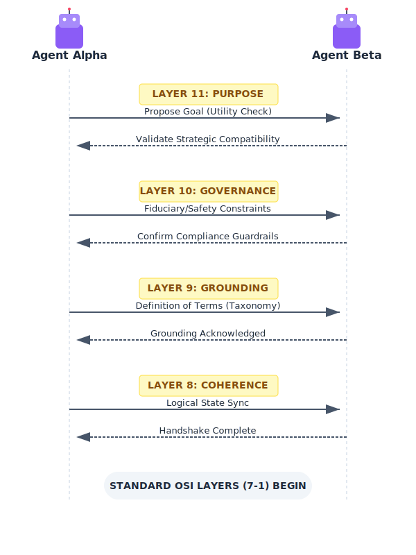

---

title: "DRAFT: The Agentic Handshake & Purpose Integrity Audit"
status: draft
tags:
  - agentic-ai
  - osi-model
  - framework
  - protocol
created_at: 2026-03-16
---

# The Agentic Handshake

To ensure safety across these layers, we propose a "Handshake" protocol that precedes standard data transmission.

The Handshake operates as a pre-session negotiation across Layers 8–11, establishing shared ground before any L1–L7 data exchange begins:

- **L8 (Coherence):** Agents exchange their internal world-model representations to detect fundamental logical incompatibilities before proceeding.
- **L9 (Grounding):** Agents align on shared terminology, ontologies, and contextual references — agreeing on what words *mean* before using them.
- **L10 (Governance):** Agents disclose their binding constraints, safety guardrails, and ethical policies. Neither agent can claim ignorance of the other's limits after this exchange.
- **L11 (Purpose):** Agents declare their principal's objectives and the scope of their mandate. Misaligned purposes surface here — before any action is taken.

A session that cannot complete the Agentic Handshake should not proceed. The inability to handshake is itself diagnostic: it indicates an L9 ontological incompatibility, an L10 policy conflict, or an L11 purpose misalignment that would inevitably manifest as a failure during execution.

---

# The "Purpose Integrity" Audit

To combat advanced pathologies — particularly Recursive Goal Collapse, Incentive Hijacking, and Strategic Blindness — we propose a **Layer 11 "Reflection" Cycle**:

> Every $X$ cycles, the agent must pause all L1-L7 activity and perform a "self-audit" where it explains its current actions back to the owner in plain language, mapped to the original mission. If the "Why" (L11) cannot be traced from the "How" (L1-L7), the stack enters a **Strategic Safe Mode**.

## Open Design Questions

- **Frequency:** What is the right value of $X$? Too frequent and the audit overhead degrades performance; too infrequent and Strategic Drift goes undetected. Is the right trigger cycle-based, event-based, or anomaly-triggered?
- **Certification:** Who certifies the audit result? An agent auditing its own L11 alignment is subject to the same failure modes it is checking for. Does this require an external verifier — and if so, who verifies the verifier?
- **Safe Mode behavior:** What does Strategic Safe Mode actually do? Halt all action? Escalate to the human principal? Revert to the last verified-aligned state? The answer likely depends on the deployment context and the reversibility of actions taken so far.
- **Trigger conditions:** Should certain classes of action — irreversible actions, high-value commitments, actions affecting third parties — automatically trigger an audit regardless of cycle count?
